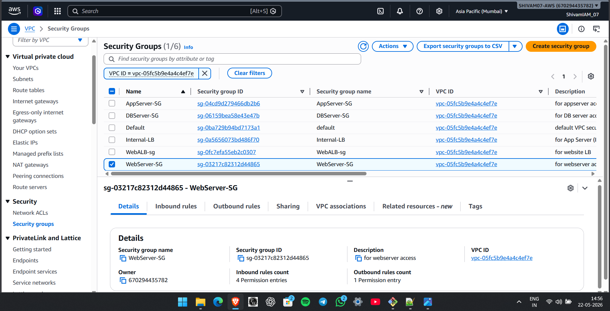
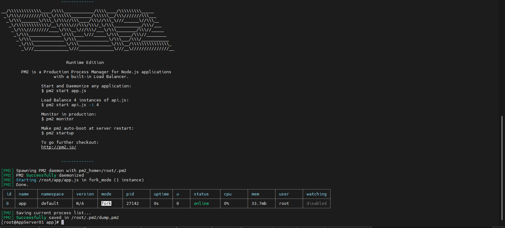

# 🚀 AWS Three-Tier Web Application Deployment


---

## 📌 **Project Overview**
This project demonstrates the design and deployment of a **scalable and secure three-tier web application architecture on AWS**.  
The architecture separates the application into **Web, Application, and Database layers** to ensure high availability, security, and scalability.

---

## 🏗️ **Architecture Diagram**
<p align="center">
  
</p>

In this architecture, a Internet-facing Application Load Balancer forwards client traffic to our web tier EC2 instances. The web tier is running Nginx webservers that are configured to serve a index.html website and redirects our API calls to the application tier’s internal facing load balancer. The internal facing load balancer then forwards that traffic to the application tier, which is written in Node.js. The application tier manipulates data in an MySQL SIngle Cluster -Free tier database and returns it to our web tier. Load balancing, health checks and autoscaling groups are created at each layer to maintain the availability of this architecture.

---

# 📌 Part 1: Network and Security

## 🌐 Network Architecture

The network architecture in this Project is designed within a custom **Virtual Private Cloud (VPC)** to ensure isolation, scalability, and secure communication between different layers of the application.

The VPC is configured with a CIDR block of **192.168.0.0/16** and deployed in the **ap-south-1 (Mumbai) region**, providing a sufficient IP address range for all resources within the architecture.

To organize resources efficiently, the VPC is divided into **Five subnets** across multiple Availability Zones. This design ensures proper isolation between tiers and enhances overall security.

<h3 align="center">VPC Resource Map</h3>
<p align="center">
  
</p>


- **Public Subnets (2):** Used for the Web Tier instances and Internet-facing Application Load Balancer  
- **Private App Subnets (2):** Used for Application Tier instances and the Internal Load Balancer  
- **Private DB Subnets (1):** Used for the Database layer  

The infrastructure spans across Three Availability Zones:

- **ap-south-1a**  
- **ap-south-1b**  
- **ap-south-1c**

This multi-AZ deployment ensures **high availability, fault tolerance, and resilience** against failures.

---

## 🌍 Internet Connectivity

Internet connectivity is established using AWS-managed networking components to allow controlled access between the application and external users.

## 🌐 Internet Gateway
An **Internet Gateway (IGW)** is attached to the VPC, enabling resources in public subnets to communicate with the internet. 

<h4 align="center">Create Internet Gateway</h4>
<p align="center">
  
</p>

<h4 align="center">Attach IGW to VPC</h4>
<p align="center">
  
</p>

Go to: 
VPC Dashboard → Internet Gateways, create a new IGW by assigning a name, 
& then attach it to your VPC using either the creation prompt or the Actions menu.

Once attached, the VPC can communicate with the internet. 
To fully enable access, ensure the route table for public subnets includes a route (`0.0.0.0/0`) pointing to the Internet Gateway.

---

## 🌐 NAT Gateway
For resources in private subnets, direct internet access is restricted to enhance security. Instead, a **NAT Gateway** is deployed in the public subnet. This allows private instances to initiate outbound internet connections (e.g., for updates or package installations) while blocking inbound traffic from external sources.

<h4 align="center">Create NAT Gateway</h4>
<p align="center">
  
</p>
<p align="center"> Go to <b>VPC Dashboard → NAT Gateways</b> → Click <b>Create NAT Gateway</b> </p>

<p align="center">
  
</p>
<p align="center"> Enter Name for NAT Gateway → Select a <b>Regional Availability</b> →  Inside manual EIP Allocation 
→ Allocate & attach <b>Elastic IP's</b> to Availability Zones → Click <b>Create NAT Gateway</b>
 </p>
 
<p align="center">
  
</p>


Regional Availability mode for NAT Gateways, allowing a single NAT gateway to automatically scale across multiple Availability Zones (AZs) without requiring a public subnet.

---

## 🛣️ Route Table Configuration

Route Tables are configured to control traffic flow between subnets and external networks.

### 🔹 Public Route Table

1. Go to **VPC Dashboard → Route Tables**
2. Click **Create Route Table** and associate it with your VPC
3. Add route: `0.0.0.0/0 → Internet Gateway (IGW)`
4. Associate it with Both **Public Subnets**

📌 Enables direct internet access for Web Tier and Internet-facing Load Balancer.

<p align="center">
  
</p>

  ---

### 🔹 Private Route Table (Application Tier)

1. Create a new **Route Table**
2. Add route: `0.0.0.0/0 → NAT Gateway`
3. Associate it with Both **Private App Subnets**

📌 Allows outbound internet access (e.g., updates) while keeping instances private. 

<p align="center">
  
</p>

  ---

### 🔹 Private Route Table (Database Tier)

1. Create a separate **Route Table**
2. Do **not** add any internet route
3. Associate it with **Private DB Subnet**

📌 Ensures the database layer remains fully isolated and secure.

<p align="center">
  
</p>

  ---

## 🔐 Security Configuration

Security is enforced using **Security Groups**, which act as virtual firewalls to regulate traffic between different layers of the architecture.
Each component is configured with controlled access rules to ensure secure and restricted communication:

<p align="center">
  
</p>

- **Load Balancer Security Group:**  
  Allows **HTTP/HTTPS traffic (ports 80/443)** from the internet  

- **Web Tier Security Group:**  
  Accepts traffic only from the **Internet-facing Application Load Balancer**  

- **Internal Load Balancer Security Group:**  
  Accepts traffic only from the **Web Tier** and forwards requests to the **Application Tier (port 3000)**  

- **Application Tier Security Group:**  
  Accepts traffic only from the **Internal Load Balancer on port 3000**
 <br> (Port 3000 – Node.js application)

- **Database Security Group:**  
  Allows **MySQL traffic (port 3306)** only from the **Application Tier**  

> 🔒 This layered security approach ensures that each tier communicates only with the required components, minimizing exposure and enhancing overall system security.

---

# 📌 Part 2: Database Deployment

### 🔹 DB Subnet Group
To ensure proper isolation, a **DB Subnet Group** is created using private database subnets across multiple Availability Zones.

<p align="center">
  
</p>

Go to the **RDS Dashboard → Subnet Groups → Create DB Subnet Group**, provide a name and description, select your VPC, and add the **database subnets from each Availability Zone**.

📌 This ensures the database is deployed in isolated private subnets.


### 🔹 Database Creation

<p align="center">
  
</p>

<p align="center">
  
</p>


Navigate to **RDS Dashboard → Databases → Create Database** and select **Full Configuration**.
- Engine: **MySQL DB Engine**
- Template: **Free Tier**
- Set **DB username and password** (Self managed)

### 🔹 Availability & Connectivity

<p align="center">
  
</p>

- Deployment: **Single-AZ deployment** (Due To Free Tier limitations)
But in Real Scenarios Multi-AZ DB Cluster Deployments are used to ensure High Availability. 
- Select your **VPC and DB Subnet Group**  
- Set **Public Access → No**  

📌 This ensures high availability and keeps the database private.

### 🔹 Security Configuration

- Attach the **Database Security Group**
- Allow **MySQL (port 3306)** only from the Application Tier
- Use **password authentication**

### 🔹 Final Setup

<p align="center">
  
</p>

After creation:
- AWS provisions **Database instance** at your Selected Subnet 
- Note the **DB Instance Endpoints** for application connectivity  

📌 This endpoint will be used by the Application Tier to interact with the database.

⚠️ Note:
> A single-cluster setup is used as it is supported under the AWS Free Tier.
> Multi-node production setups require paid configurations.

---

# 📌 Part 3: Application Tier Deployment

## 🔐 Instance Access (App Tier)
The **App Tier instances** are deployed in private subnets and do not have direct internet access.
To securely access these instances, a **Jump Server (Bastion Host)** is used:

- The **Jump Server** is deployed in a **public subnet**
- SSH access is allowed only to the **Jump Server**
- From the Jump Server, access is established to **App Tier instances in private subnets**

<p align="center">
  
</p>

📌 Traffic Flow: User → Jump Server (Public Subnet) → App Tier (Private Subnet)

📌 This approach ensures:
- No direct exposure of private instances to the internet  
- Controlled and secure administrative access

> 📌 Note: Alternatively, AWS Systems Manager Session Manager can be used to access instances without SSH or a bastion host.

## 🚀 App Tier Instance Setup
An EC2 instance is deployed in the **private app subnet** to host the Node.js application running on **port 3000**.

### 🔹 Instance Configuration
- AMI: **Amazon Linux 2023**
- Instance Type: **t3.micro (Free Tier)**
- Subnet: **Private App Subnet 1a**
- Security Group: **App Tier SG**

---

## 🔌 Connectivity Check
After connecting via SSH, verify internet access:
```bash
ping 8.8.8.8
```
📌 Confirms outbound connectivity via NAT Gateway.

## 🗄️ Database Configuration
Install MySQL client and connect to MySQL DB:

```bash
sudo yum install mariadb -y
mysql -h <RDS-ENDPOINT> -u <USERNAME> -p
```

### Create Database & Table:
<p align="center">
  
</p>

## ⚙️ Application Setup
Creating App Directory & adding Node js App
```bash
mkdir /myapp
cd /myapp
vi app.js
```

### Install Nodejs & NPM
```bash
sudo yum install nodejs npm -y
node -v
npm -v
```

## ⚙️ Environment Configuration & Dependencies
### 🔹 Create `.env` File
To securely manage configuration, create a `.env` file in the root directory of your application:

```bash
vi /myapp/.env
chmod 600 .env
```
Add the following environment variables:

```bash
DB_HOST=your-rds-endpoint
DB_USER=admin
DB_PASSWORD=your-password
DB_NAME=volunteerdb
PORT=3306
```
⚠️ Replace the values with your actual RDS database credentials and endpoint.


### Initialize Node project
```bash
npm init -y
npm install express mysql2 dotenv cors
```
This Creates package.json & Sets default project configuration


### Test run Application
```bash
node app.js
```

<p align="center">
  
</p>

### Install PM2
```bash
npm install -g pm2
pm2 start app.js
pm2 startup
pm2 save
```

<p align="center">
  
</p>

### Health check
```bash
curl http://localhost:3000/health
```
<p align="center">
  
</p>

## ✅ App-Server Setup Completed
The Application server has been successfully deployed and configured.

### ✔️ Key Achievements
- Node.js application running on **port 3000**
- Successfully connected to **MySQL database**
- Data retrieval verified via API endpoints  
- App process managed using **PM2**
- Private instance access secured via **Jump Server**
- Outbound internet access enabled via **NAT Gateway**

---
# 📌 Part 4: Web Tier Deployment
## 🌐 Web Tier Overview

The **Web Tier** is responsible for handling incoming client requests and serving static content. 
It also forwards API requests to the Application Tier.

This layer is deployed in **public subnets** and is exposed to the internet via an **Internet-facing Application Load Balancer**.

---

## 🚀 Web Server Setup

EC2 instances are launched in **public subnets** to host the web server.

### 🔹 Instance Configuration

- AMI: **Amazon Linux 2023**
- Instance Type: **t3.micro**
- Subnet: **Public Subnet**
- Security Group: **Web Tier SG (HTTP/HTTPS allowed)**

---

## ⚙️ Nginx Installation & Configuration
Install and start Nginx:
```bash
sudo yum install nginx -y
sudo systemctl start nginx
sudo systemctl enable nginx
sudo systemctl status nginx
```
<p align="center">
  
</p>

## 🔁 Reverse Proxy Configuration:
Update Nginx config to forward API requests to App Tier via Internal Load Balancer

```bash
sudo nano /etc/nginx/nginx.conf
sudo systemctl restart nginx
```

<p align="center">
  
</p>


# 🔁 Part 5: Post App & Web Setup -AMI, Launch Template & Auto Scaling
After completing the App Tier setup, the configured instance is used to enable **scalability and high availability**.

---

### 🖼️ Step 1: Create AMI (Golden Image) from AppServer1

<p align="center">
  
</p>

Go to **EC2 Dashboard → Instances** → Select **AppServer1** → Click **Actions → Image and templates → Create Image**
Provide a **name and description** → Click **Create Image**

📌 This AMI contains:
- OS configuration  
- Installed software (Node.js, PM2, etc.)  
- Application code  

### 🔹 Step 2: Launch AppServer2 from AMI
Go to **EC2 Dashboard → AMIs** → Select the created **AMI** → Click **Launch Instance**
Choose:
   - Instance type: **t3.micro**
   - Network: **Same VPC**
   - Subnet: **Private App Subnet 1b**
   - Security Group: **App Tier SG**
Launch the instance

---

### 🔹 Result

- **AppServer2** is an exact replica of **AppServer1**
- No need to manually configure software again  
- Ensures **consistency and faster scaling**

📌 This approach is later used in **Launch Templates and Auto Scaling Groups**.

---

### 📦 Step 2: Create Launch Template

A **Launch Template** is created using the AMI to standardize instance deployment.

<p align="center">
  
</p>


- Navigate to **EC2 → Launch Templates → Create Launch Template**
- Select: AMI: **App Server AMI**, Instance Type: **t3.micro** & Security Group: **App Tier SG**

 <h4 align="center">AppServer Template</h4>   
<p align="center">
  
</p>

📌 Ensures all future instances are **identical and pre-configured**.

---

### 🎯 Step 3: Target Group Creation

<p align="center">
  
</p>

- Go to **EC2 → Target Groups** → Create a target group:
  - Target Type: **Instances**
  - Protocol: **HTTP**
  - Port: **3000**
  - Health Check Path: **/health**

📌 Used by Load Balancer to distribute traffic.

---

### 🔁 Step 4: Auto Scaling Group (ASG)

<p align="center">
  
</p>

- Go to **EC2 → Auto Scaling Groups** → Create ASG using the **Launch Template**
- Select:
  - VPC + **Private App Subnets**
  - Attach to **Target Group**
  - Desired Capacity: **2**
  - Min: **2**
  - Max: **3**

📌 Automatically maintains and replaces unhealthy instances.

---
### Internal Load Balancer Setup:


### ✅ Final Outcome

- App instances are **automatically deployed from AMI**
- Load is distributed via **Target Group + Load Balancer**
- System is **highly available and self-healing**

📌 This completes the transition from a single instance to a **scalable production-ready architecture**.

To replicate the configured application server, an **Amazon Machine Image (AMI)** is created from **AppServer1** and used to launch additional instances.


## 🖼️ Create AMI from AppServer1 & Launch AppServer2


### 📌 Outcome

The App Tier is now:
- **Scalable**
- **Highly available**
- **Secure (private subnet architecture)**
- **Production-ready (with load balancing & auto scaling)**

---


## 📜 **License**
This project is licensed under the **MIT License**.

---

## 👨‍💻 **Author**
**Shivam**  
- 💼 LinkedIn: *(add your link)*  
- 🌐 Portfolio: *(add your link)*  

---
