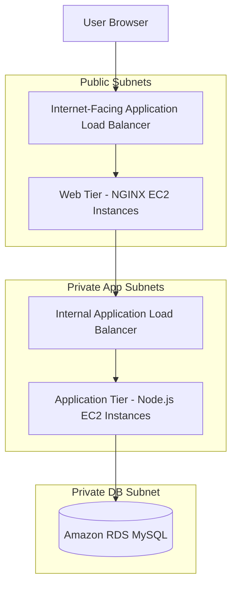
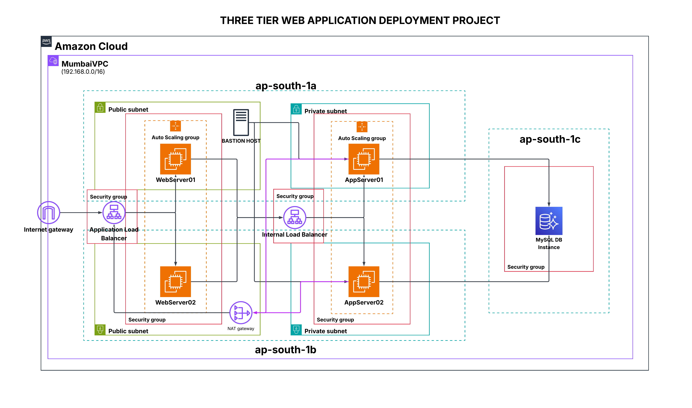

# 🚀 AWS Three-Tier Web Application Deployment


---

## 📌 Project Overview

This project demonstrates the design and deployment of a **scalable, secure, and highly available Three-Tier Web Application Architecture on AWS**.

The architecture separates the application into three layers:

```text
Web Tier
Application Tier
Database Tier
```

This separation improves security, scalability, fault isolation, and maintainability. The project uses Amazon VPC, public and private subnets, Application Load Balancers, Auto Scaling Groups, EC2 instances, NGINX, Node.js, and Amazon RDS MySQL.

---

## 🏗️ Architecture Flow

```text
User Browser
     |
     v
Internet-Facing Application Load Balancer
     |
     v
Web Tier - NGINX EC2 Instances
     |
     v
Internal Application Load Balancer
     |
     v
Application Tier - Node.js EC2 Instances
     |
     v
Database Tier - Amazon RDS MySQL
```

---

## 🧭 Architecture Diagram using Mermaid



---

## 📸 Architecture Diagram

<p align="center">
  
</p>

```text
Images/1.AWS-Architecture.png
```

---

## 🧰 AWS Services Used

| AWS Service | Purpose |
|---|---|
| Amazon VPC | Provides isolated networking environment |
| Public Subnets | Hosts Web Tier and Internet-facing Load Balancer |
| Private App Subnets | Hosts Application Tier instances |
| Private DB Subnets | Hosts database layer |
| Internet Gateway | Enables internet access for public resources |
| NAT Gateway | Allows private instances to access the internet securely |
| EC2 | Hosts NGINX and Node.js application servers |
| Application Load Balancer | Distributes traffic across Web and App tiers |
| Auto Scaling Group | Maintains availability and scaling |
| Amazon RDS MySQL | Stores application data |
| Security Groups | Controls traffic between tiers |
| IAM | Provides secure AWS access permissions |
| Amazon CloudWatch | Supports logs and basic resource visibility |

---

## 📁 Project Structure

```text
AWS-Three-Tier-Web-Application-Deployment/
│
├── Images/
│   ├── 1.AWS-Architecture.png
│   ├── 2.VPC-ResourceMap.png
│   ├── 3.Create IGW.png
│   └── ...
│
├── app/
│   ├── app.js
│   ├── package.json
│   └── .env.example
│
├── web/
│   ├── index.html
│   └── nginx.conf
│
├── README.md
├── LICENSE
└── .gitignore
```

---

# 📌 Part 1: Network and Security

## 🌐 VPC Architecture

A custom VPC is created to isolate the entire application environment.

| Component | Configuration |
|---|---|
| Region | `ap-south-1` |
| VPC CIDR | `192.168.0.0/16` |
| Public Subnets | 2 |
| Private App Subnets | 2 |
| Private DB Subnets | 1 |
| Availability Zones | Multiple AZs |

The VPC is divided into public and private subnets to separate internet-facing resources from internal application and database components.

---

## 🔹 Public Subnets

Public subnets are used for:

```text
Internet-facing Application Load Balancer
Web Tier EC2 instances
Jump Server / Bastion Host
```

These subnets have a route to the Internet Gateway.

---

## 🔹 Private App Subnets

Private App subnets are used for:

```text
Node.js Application Tier EC2 instances
Internal Application Load Balancer
```

These instances are not directly accessible from the internet. They use NAT Gateway for outbound internet access.

---

## 🔹 Private Database Subnet

The database subnet is used for Amazon RDS MySQL.

The database is not publicly accessible and accepts traffic only from the Application Tier security group.

---

## 🔹 Internet Gateway

An Internet Gateway is attached to the VPC to allow internet access for public resources.

<p align="center">
  
</p>

<p align="center">
  
</p>

---

## 🔹 NAT Gateway

A NAT Gateway is deployed to allow private instances to access the internet for updates and package installation without exposing them to inbound internet traffic.

<p align="center">
  
</p>

---

## 🔹 Route Tables

### Public Route Table

```text
0.0.0.0/0 → Internet Gateway
```

Associated with public subnets.

<p align="center">
  
</p>

### Private App Route Table

```text
0.0.0.0/0 → NAT Gateway
```

Associated with private application subnets.

<p align="center">
  
</p>

### Private DB Route Table

No internet route is added to the database route table.

<p align="center">
  
</p>

---

## 🔐 Security Group Design

Security groups are configured to allow only required traffic between layers.

| Security Group | Allowed Traffic |
|---|---|
| Internet ALB SG | HTTP/HTTPS from internet |
| Web Tier SG | HTTP from Internet ALB |
| Internal ALB SG | HTTP from Web Tier |
| App Tier SG | Port 3000 from Internal ALB |
| Database SG | MySQL 3306 from App Tier |

<p align="center">
  
</p>

---

# 📌 Part 2: Database Tier Deployment

## 🗄️ Database Overview

Amazon RDS MySQL is used as the database layer. The database is deployed in a private subnet and is not publicly accessible.

| Component | Configuration |
|---|---|
| Engine | MySQL |
| Deployment | Single-AZ |
| Public Access | Disabled |
| Authentication | Password-based |
| Connectivity | App Tier only |

> A Single-AZ database setup is used for this project because it fits the AWS Free Tier. In production, Multi-AZ database deployment is recommended for high availability.

---

## 🔹 Create DB Subnet Group

A DB subnet group is created using private database subnets.

<p align="center">
  
</p>

---

## 🔹 Create RDS MySQL Database

Create database:

```text
RDS Dashboard → Databases → Create Database
```

Configuration:

```text
Engine: MySQL
Template: Free Tier
Public Access: No
VPC: Custom VPC
Subnet Group: Private DB Subnet Group
Security Group: Database SG
```

<p align="center">
  
</p>

<p align="center">
  
</p>

---

# 📌 Part 3: Application Tier Deployment

## ⚙️ Application Tier Overview

The Application Tier runs a Node.js backend application on EC2 instances inside private subnets.

The application connects to Amazon RDS MySQL and exposes APIs on port `3000`.

---

## 🔹 Access App Tier Through Jump Server

Because the application instances are private, access is done through a Jump Server / Bastion Host.

```text
User → Jump Server → Private App Server
```

<p align="center">
  
</p>

---

## 🔹 Install Node.js and npm

```bash
sudo yum install nodejs npm -y
node -v
npm -v
```

---

## 🔹 Create Application Directory

```bash
mkdir /myapp
cd /myapp
```

---

## 🔹 Configure Environment Variables

Create `.env` file:

```bash
vi .env
chmod 600 .env
```

Add:

```bash
DB_HOST=your-rds-endpoint
DB_USER=admin
DB_PASSWORD=your-password
DB_NAME=volunteerdb
PORT=3000
```

---

## 🔹 Install Dependencies

```bash
npm init -y
npm install express mysql2 dotenv cors
```

---

## 🔹 Run Application

```bash
node app.js
```

<p align="center">
  
</p>

---

## 🔹 Manage App with PM2

```bash
npm install -g pm2
pm2 start app.js
pm2 startup
pm2 save
```

<p align="center">
  
</p>

---

## 🔹 Health Check

```bash
curl http://localhost:3000/health
```

<p align="center">
  
</p>

---

# 📌 Part 4: Web Tier Deployment

## 🌐 Web Tier Overview

The Web Tier handles user requests, serves the frontend, and forwards API requests to the Application Tier through the internal load balancer.

The Web Tier uses NGINX running on EC2 instances in public subnets.

---

## 🔹 Install NGINX

```bash
sudo yum install nginx -y
sudo systemctl start nginx
sudo systemctl enable nginx
sudo systemctl status nginx
```

<p align="center">
  
</p>

---

## 🔹 Configure NGINX Reverse Proxy

Edit NGINX configuration:

```bash
sudo vi /etc/nginx/nginx.conf
sudo systemctl restart nginx
```

NGINX forwards API requests to the internal Application Load Balancer.

<p align="center">
  
</p>

---

## 🔹 Add Frontend Page

```bash
vi /usr/share/nginx/html/index.html
```

---

# 📌 Part 5: AMI, Launch Templates, Auto Scaling and Load Balancing

## 🚀 Post Deployment Overview

After configuring the Web Tier and Application Tier, AMIs are created from the configured EC2 instances. These AMIs are used in Launch Templates and Auto Scaling Groups.

This improves:

```text
High Availability
Fault Tolerance
Automatic Recovery
Scalability
```

---

## 🔹 Create AMI

<p align="center">
  
</p>

---

## 🔹 Create Launch Templates

Launch Templates define:

```text
AMI ID
Instance Type
Security Group
Key Pair
User Data
```

<p align="center">
  
</p>

---

## 🔹 Create Target Groups

Create target groups for:

```text
Web Tier
Application Tier
```

<p align="center">
  
</p>

<p align="center">
  
</p>

---

## 🔹 Internet-Facing Load Balancer

The Internet-facing ALB receives user traffic and forwards it to the Web Tier.

<p align="center">
  
</p>

---

## 🔹 Internal Load Balancer

The Internal ALB forwards requests from the Web Tier to the Application Tier.

<p align="center">
  
</p>

---

## 🔹 Auto Scaling Groups

Auto Scaling Groups are created for both Web Tier and App Tier.

<p align="center">
  
</p>

Benefits:

```text
Maintains desired number of instances
Replaces unhealthy instances
Improves high availability
Supports scaling based on demand
```

---

# 📌 Part 6: Application Testing

## ✅ Test Web Tier

Open the Internet-facing ALB DNS:

```text
http://YOUR-INTERNET-FACING-ALB-DNS
```

---

## ✅ Test App Tier Health

From the application server:

```bash
curl http://localhost:3000/health
```

---

## ✅ Test Database Connectivity

Install MySQL client:

```bash
sudo yum install mariadb -y
```

Connect to RDS:

```bash
mysql -h <RDS-ENDPOINT> -u <USERNAME> -p
```

---

## ✅ End-to-End Flow

```text
User → Internet ALB → Web Tier NGINX → Internal ALB → Node.js App Tier → RDS MySQL
```

---

# 🎥 Application Demo Video

This video demonstrates the working deployment of the **AWS Three-Tier Web Application**, showcasing end-to-end connectivity between the frontend, backend, and database layers.

<p align="center">
  <a href="https://youtu.be/g-qtxnyHksw">
    
  </a>
</p>

<h4 align="center">📌 Click on the image above to watch the full demo on YouTube.</h4>

---

## 🖼️ Screenshots

<p align="center">
  
</p>

<p align="center">
  
</p>

<p align="center">
  
</p>

<p align="center">
  
</p>

<p align="center">
  
</p>

---

# 🛠️ Challenges Faced

## 1. Private Instance Access

### Challenge

Application Tier instances were deployed in private subnets and could not be accessed directly.

### Solution

Used a Jump Server in the public subnet to securely connect to private instances.

---

## 2. Database Security

### Challenge

The database needed to remain private while still allowing the application to connect.

### Solution

Placed RDS in a private subnet and allowed MySQL traffic only from the Application Tier security group.

---

## 3. Reverse Proxy Configuration

### Challenge

Frontend requests needed to reach the backend through the internal load balancer.

### Solution

Configured NGINX reverse proxy rules to forward API requests to the internal ALB.

---

## 4. High Availability

### Challenge

Manual EC2 deployment could fail if an instance became unhealthy.

### Solution

Created AMIs, Launch Templates, Target Groups, Load Balancers, and Auto Scaling Groups.

---

# 💰 Cost Optimization

To reduce AWS cost:

- Use Free Tier eligible EC2 instances where possible
- Use Single-AZ RDS for learning projects
- Delete unused NAT Gateways after practice
- Delete unused Load Balancers
- Stop or terminate unused EC2 instances
- Monitor billing using AWS Cost Explorer

Cost-generating services:

```text
EC2 Instances
RDS MySQL
NAT Gateway
Application Load Balancer
EBS Volumes
Data Transfer
```

---

# 🎯 Learning Outcomes

This project demonstrates hands-on experience with:

- Amazon VPC design
- Public and private subnet architecture
- Internet Gateway and NAT Gateway configuration
- Route table management
- Security Group design
- EC2 deployment
- Jump Server access
- NGINX reverse proxy configuration
- Node.js backend deployment
- RDS MySQL connectivity
- AMI creation
- Launch Templates
- Target Groups
- Application Load Balancers
- Auto Scaling Groups
- Three-tier architecture design
- AWS infrastructure troubleshooting

---

# 🧹 Cleanup

To avoid unnecessary AWS billing:

```text
Delete Auto Scaling Groups
Delete Load Balancers
Delete Target Groups
Delete Launch Templates
Delete AMIs and Snapshots
Delete EC2 Instances
Delete RDS Database
Delete NAT Gateway
Release Elastic IP
Delete VPC resources
```

---

# 📜 License

This project is licensed under the **MIT License**.

---

# 👨‍💻 Author

## Shivam Ekale

AWS Certified Solutions Architect – Associate  
Cloud & DevOps Engineer

### Connect With Me

- GitHub: https://github.com/Its-Shiivam22
- LinkedIn: https://www.linkedin.com/in/shiivam22
- Portfolio: https://www.shivamekale.in
- Email: shivamekale07@gmail.com

---

# ⭐ Support

If you found this project helpful, consider giving it a ⭐ on GitHub.
