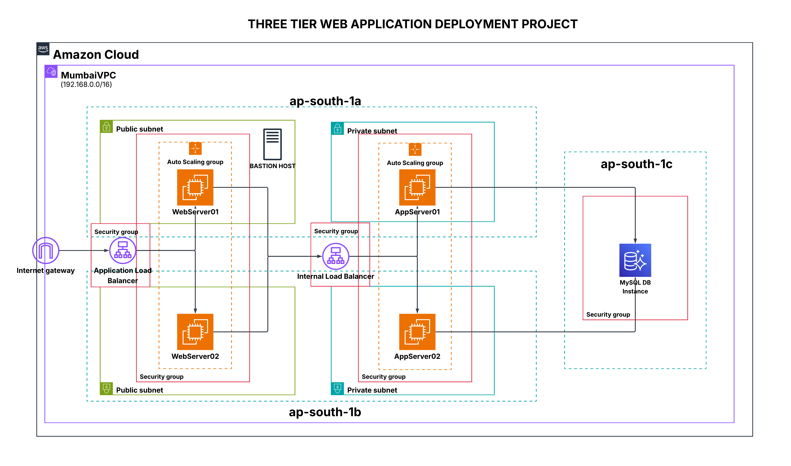

# 🚀 AWS Three-Tier Web Application Deployment

---

## 📌 **Project Overview**
This project demonstrates the design and deployment of a **scalable and secure three-tier web application architecture on AWS**.  
The architecture separates the application into **Web, Application, and Database layers** to ensure high availability, security, and scalability.

---

## 🏗️ **Architecture Diagram**

In this architecture, a Internet-facing Application Load Balancer forwards client traffic to our web tier EC2 instances. The web tier is running Nginx webservers that are configured to serve a index.html website and redirects our API calls to the application tier’s internal facing load balancer. The internal facing load balancer then forwards that traffic to the application tier, which is written in Node.js. The application tier manipulates data in an MySQL SIngle Cluster -Free tier database and returns it to our web tier. Load balancing, health checks and autoscaling groups are created at each layer to maintain the availability of this architecture.

---

## 📜 **License**
This project is licensed under the **MIT License**.

---

## 👨‍💻 **Author**
**Shivam**  
- 💼 LinkedIn: *(add your link)*  
- 🌐 Portfolio: *(add your link)*  

---
